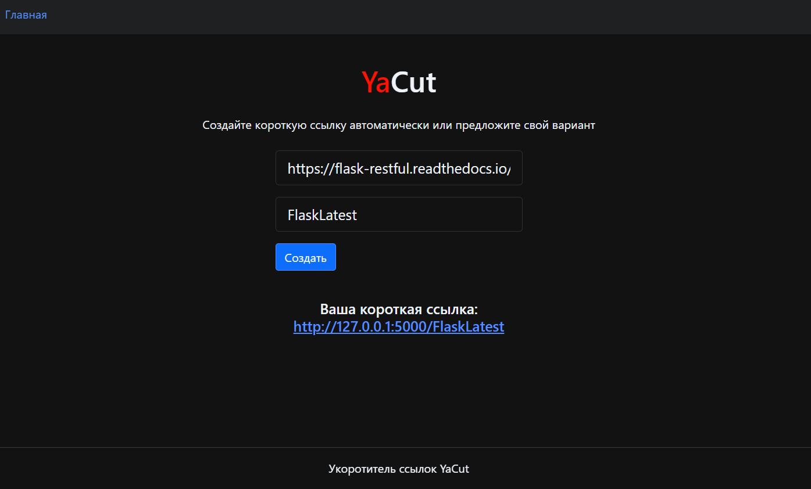

# YaCut - сервис укорачивания ссылок

## **Основная цель проекта**
На большинстве сайтов адреса страниц довольно длинные, 
удобнее использовать короткие ссылки.
Сервис позволяет пользователю создавать самостоятельно, 
либо генерировать автоматически, короткие уникальные идентификаторы,
которые будут ассоциированы с оригинальной длинной ссылкой.


### **Используемые языки, технологии**
Python3  
Flask  
Jinja2  
SQLAchemy  
Flask API  

##  **Описание проекта**
Сервис реализован на Flask, в качестве ORM используется SQLAchemy. 
Для генерации HTML-страницы разработаны HTML-шаблоны
(используется шаблонизатор Jinja2). Также для проекта реализован API. 
Выполняется валидация данных и обработка ошибок. 

**Ключевые возможности:**
- генерация коротких ссылок и связь их с исходными длинными ссылками,
- переадресация на исходный адрес при обращении к коротким ссылкам.

**Пример HTML-страницы с заполненной формой и созданной короткой ссылкой:**




**Пример POST-запроса к API-проекта и успешного ответа:**

POST-запрос к эндпоинту http://127.0.0.1:5000/api/id/  
Request
```
{
    "url": "https://flask-restful.readthedocs.io/en/latest/",
    "custom_id": "flasklatest"
}
```
Response
```
{
    "short_link": "http://127.0.0.1:5000/flasklatest",
    "url": "https://flask-restful.readthedocs.io/en/latest/"
}
```

## **Запуск проекта**
Выполните следующие команды в терминале:

1. Клонировать репозиторий и перейти в него:
```
git clone git@github.com:DoeryMK/yacut.git
```
или
```
git clone https://github.com/DoeryMK/yacut.git
```
```
cd yacut
```
2. Создать, активировать виртуальное окружение:

```
python3 -m venv venv
```

* Если у вас Linux/macOS

    ```
    source venv/bin/activate
    ```

* Если у вас windows

    ```
    source venv/scripts/activate
    ```

3. Установить зависимости из файла requirements.txt:

```
python3 -m pip install --upgrade pip
```

```
pip install -r requirements.txt
```
4.  Создать файл «.env», добавив в него переменные окружения:
```
touch .env
```
5. Выполнить команду запуска проекта:
```
flask run
```
### _Описание шаблона .env_
Необходимо указать переменные окружения в следующем формате:

FLASK_APP = *название приложения*  
FLASK_ENV = *режим работы приложения: продакшен или разработка*    
DATABASE_URI = *подключение БД, например: sqlite:///db.sqlite3*   
SECRET_KEY = *уникальный секретный ключ*  


## **Работа со спецификацией**
Для работы с документацией файл ```openapi.yml``` можно открыть 
в онлайн-редакторе [Swagger Editor](https://editor.swagger.io). 

## **Тестирование через HHTP-клиент**
Для тестирования работы API проекта удобно пользоваться 
HHTP-клиентами: [Postman](https://www.postman.com) или [httpie](https://httpie.io). 


## Авторы: Мухамеджанова Дарья ([DoeryMK](https://github.com/DoeryMK)) 